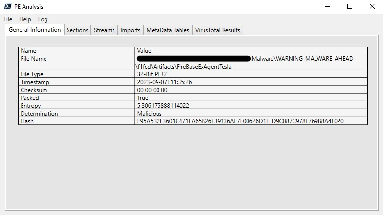
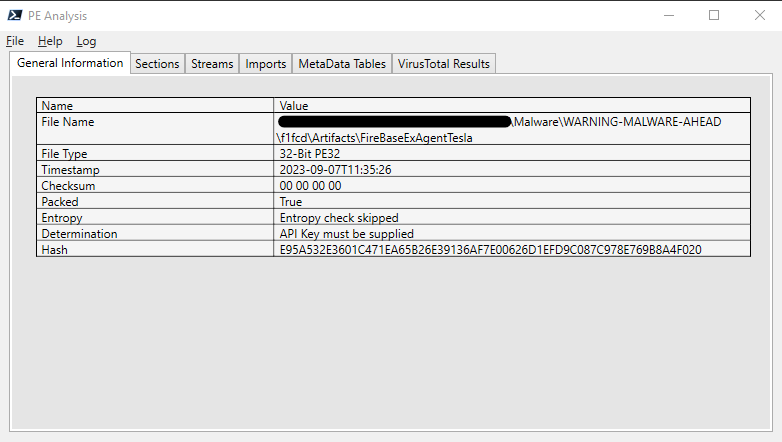
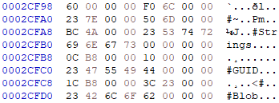
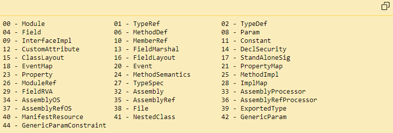

Invoke-PEAnalysis
=================

*Breakdown, Usage, and Full Documentation Guide*  
*Last updated July, 2024*
 
 
 

Contents  
========

1. [Module Usage](#module-usage)
    1. Switches
    2. Output Modes
    3. Examples
2. [Module Breakdown](#module-breakdown)
    1. Design Philosophy
    2. History
    3. Function Breakdown
3. [Full Documentation](#full-documentation)
    1. PE File Types
    2. PE File Structures
    3. Parsing PE Files in PowerShell

  
 
 
 

Module Usage
===========

Invoke-PEAnalysis is designed to read PE file types and extract relevant information for analysis. As such, it supports several switches and output options. By default, Invoke-PEAnalysis logs important information to `$env:USERPROFILE\Documents\PEAnalysis\PEAnalysis.log`. Future updates will include support for logging levels as seen in other projects ([SimplePowerShellHttpServer](https://github.com/lpowell/SimplePowerShellHTTPServer)). This section of documentation covers all of the various switches and output modes included in the current release of Invoke-PEAnalysis. It also includes example execution scenarios. 

Switches
--------

The following switches are currently supported.

|Switch|Default Value|Accepted Values|Mandatory|PipelineInput|Description|
|------|-------------|--------------|--------|--------|--------|
|Path |None|Any file path or name|True |True |The file path (relative or absolute) of the file to examine|
|LogFile|"$env:USERPROFILE\Documents\PEAnalysis\PEAnalysis.log"|Any file path or name|False|False|The file to write logs to 
|Style|Defaults to GUI output|Text or Object|False|False|Sets the output style. By default, outputs to the GUI impmlementation. Text will display the object returns as strings. Object will pass the resulting objects directly.|
|APIKey|None|VirusTotal API Key as a string|False|False|Sets the VirusTotal API Key for the execution. This key will be stored as plaintext at `$env:USERPROFILE\Documents\Invoke-FileAnalysis\APIKeys.json`. The module will attempt to get the VirusTotal key from this file first.|
|SkipEntropyCheck|False|Switch type argument|False|False|Skips the entropy check. Useful for large files.|
|SkipVirusTotalCheck|False|Switch type argument|False|False|Skips the VirusTotal API calls.|

Output Modes
------------

The following are the current output formats.

GUI (Default)
 

 
 
Object `-Style Object `

    FileName         : ******Malware\WARNING-MALWARE-AHEAD\f1fcd\Artifacts\FireBaseExAgentTesla
    Hash             : E95A532E3601C471EA65B26E39136AF7E00626D1EFD9C087C978E769B8A4F020
    Type             : 32-Bit PE32
    TimeStamp        : 2023-09-07T11:35:26
    Checksum         : 00 00 00 00
    Packed           : True
    Entropy          : 5.30617588811402
    SectionNames     : {.text, .rsrc, .reloc}
    SectionOffsets   : {00 00 20 00, 00 03 E0 00, 00 04 00 00}
    MetadataOffset   : 00 02 CF 78
    Streams          : {#~, #Strings, #GUID, ##Blob}
    StreamsOffset    : {00 00 00 60, 00 00 6D 50, B8 0C 00 00, 00 B8 1C 00}
    ImportTable      : {mscoree.dll}
    TypeRefNames     : {Object, RemoteCertificateValidationCall, X509Certificate, X509Chain…}
    TypeRefNamespace : {System, System.Net.Security, System.Security.Cryptography.X5, System.Security.Cryptography.X5…}
    Methods          : {hp3Cz6iY, .ctor, kA4r, 0nMJdMO6YL…}
    Params           : {TPxP, LJUb7ooeO, YGjXWFGA, dTAwTevrcHp…}
    MemberRef        : {.ctor, .ctor, .ctor, .ctor…}
    Events           : {KeyDown, KeyUp, Changed}
    ModuleRef        : {user32.dll, psapi.dll, user32, kernel32…}
    Imports          : {GetForegroundWindow, GetWindowText, GetWindowTextLength, GetKeyboardState…}
    AssemblyRef      : {mscorlib, System, System.Windows.Forms, System.Security…}

    File          : ******\Malware\WARNING-MALWARE-AHEAD\f1fcd\Artifacts\FireBaseExAgentTesla
    Determination : Malicious
    Hash          : E95A532E3601C471EA65B26E39136AF7E00626D1EFD9C087C978E769B8A4F020
    Malicious     : 52
    Suspicious    : 0
    Harmless      : 0
    Raw           : {[data, System.Management.Automation.OrderedHashtable]}
    Link          : https://www.virustotal.com/gui/file/e95a532e3601c471ea65b26e39136af7e00626d1efd9c087c978e769b8a4f020

 
 

Text `-Style Text`

    FileName
        ******Malware\WARNING-MALWARE-AHEAD\f1fcd\Artifacts\FireBaseExAgentTesla
    Type
            32-Bit PE32
    TimeStamp
            2023-09-07T11:35:26
    Checksum
            00 00 00 00
    SectionNames
            .text
            .rsrc
            .reloc

    SectionOffsets
            00 00 20 00
            00 03 E0 00
            00 04 00 00

    MetadataOffset
            00 02 CF 78

    Streams
            #~
            #Strings
            #GUID
            ##Blob

    StreamsOffset
            00 00 00 60
            00 00 6D 50
            B8 0C 00 00
            00 B8 1C 00

    ImportTable
            mscoree.dll
    <--snipped-->

Examples
--------

    PS>Invoke-PEAnalysis 'C:\******\Malware\WARNING-MALWARE-AHEAD\f1fcd\Artifacts\FireBaseExAgentTesla'

 
 
    
    PS>Invoke-PEAnalysis 'C:\******Malware\WARNING-MALWARE-AHEAD\f1fcd\Artifacts\FireBaseExAgentTesla' -SkipEntropyCheck -SkipVirusTotalCheck

 
 

    PS>Invoke-PEAnalysis 'C:\******\Malware\WARNING-MALWARE-AHEAD\f1fcd\Artifacts\FireBaseExAgentTesla' -SkipEntropyCheck -Style Object | Select Determination

    Determination
    -------------

    Malicious

 
 
 

Module Breakdown
================

There are five main functions contained in the code. These are documented within the code itself. This section expands on those notes and provides a more holistic overview of the workings of the module. 

Design Philosophy
-----------------

The design philosophy was relatively simple. The previous module, Invoke-FileAnalysis, attempted to recreate various tools and incorporate them into one suite of tools. The focus of this module was to further improve various aspects of the PE file parser in INvoke-FileAnalysis. To do this, the following goals were set.

1. All functions should be purposeful
2. The module should export a single function that is used to manage the other functions
3. The code should flow in the order of execution
4. Important actions should be logged

While this isn't a very definitive or structured "philosophy", it was good enough for this project. I am not a developer, so good coding practices are not something I am particularly interested in. 

History
-------

As mentioned above, this project is the "successor" to Invoke-FileAnalysis. Invoke-FileAnalysis contains many more capabilities that do not exist in Invoke-PEAnalysis. However, this module has been designed as the successor to the PE parsing capability of Invoke-FileAnalysis. At some point, it is likely that this module will be bundled into Invoke-FileAnalysis. Redesign of all features is something that is planned. 

The main reasons for creating a new module rather than expanding or updating the Invoke-FileAnalysis project is largely due to the amount of work that went into redeveloping the PE Parser. Invoke-FileAnalysis is roughly 1400 lines of code. This includes a Strings-like capability, File Signature analyzer, VirusTotal reputation module, and a PE parser. Invoke-PEAnalysis is just under 2000 lines of code. This is limited to a PE parser and VirusTotal reputation. Of course, a large part of this code base is the new WPF GUI - which on it's own should've been a release. Due to the size of the update, it felt prudent to "make it its own thing". 

Invoke-FileAnalysis will be updated to include rewritten and improved tools. Each tool will have a separate release, and Invoke-FileAnalysis will become a sort of installer and manager for these tools. 

Function Breakdown
------------------

FileValidation

    Function FileValidation([Parameter(Mandatory=$True)]$Path){
        try {
            # Test if file exists
            if((-Not ([System.IO.File]::Exists($Path.Value))) -And (-Not ([System.IO.File]::Exists("$(pwd)$($Path.Value)")))){
                throw "File does not exist: $Path"
            }
            if([System.IO.File]::Exists("$(pwd)$($Path.Value)")){
                $Path.Value = "$(pwd)$($Path.Value)"
            }

            # Test for PE header
            $ByteArray = [System.Byte[]]::CreateInstance([System.Byte], 10) 
            $FileReader = New-Object System.IO.FileStream($Path.Value, "Open")
            $FileReader.Read($ByteArray, 0, 10) | Out-Null
            $ByteArray = [CustomConvert]::ToHexString($ByteArray)
            $ByteArray = $ByteArray -replace '..(?!$)','$0 '
            $FileReader.Dispose()

            # Return the bool status of the operation
            return ($ByteArray -match "4D 5A")
        }
        catch {
            # Log contextual errors 
            Write-Log ($_.ScriptStackTrace).ToString() 1
            Write-Log ($_.Exception).ToString() 1
            Write-Log ($_.FullyQualifiedErrorId).ToString() 1
            return $false
        }
    }

The FileValidation function performs a quick check on the first 10 bytes of the file. This is to confirm if the PE magic header, or file signature, is present. The file signature for all PE files is 4D 5A. If a file does not have this signature, the function throws an error and quits execution. This ensures that non-PE files are never passed to the actual parsing function. 

Furthermore, FileValidation performs a path check on a submitted file. The `$Path` variable sent to FileValidation is a reference to the `$Path` input variable that is a part of the cmdletbinding paramters exported with Invoke-PEAnalysis. The main function passes this variable as `[ref]$Path`. This allows updates to `$Path` in the FileValidation function to enact change on the global `$Path` value without specifically declaring it as a `$global` variable within the script. Without passing the `$Path` vvariable as a reference, any changes to the variable would be limited to the local function scope. Due to the reference, this function can validate the file and check for absolute path or relative path and update the `$Path` variable to ensure all other functions are accessing the correct path. 

 
 

IsPacked

    Function IsPacked(){
        # Test for packing by evaluating file entropy - Will build sig detectors into Ripper maybe
        # I stole this from https://github.com/TonyPhipps/Powershell/blob/master/Get-Entropy.psm1 
        # And this https://cocomelonc.github.io/malware/2022/11/05/malware-analysis-6.html
        # I can't do math on my own :(
        begin{
            $stopwatch = [System.Diagnostics.Stopwatch]::new()
            $Stopwatch.Start()
        }process{
            Write-Log "Checking for packing via entropy" 1
            
            # Read all bytes of file into a byte array 
            $file = [System.IO.File]::ReadAllBytes("$Path")

            # Group the byte array by value
            $group = $file | Group-Object

            # Set entropy to 0
            $global:entropy = 0.0

            # Shannon Entropy 
            Foreach($x in $group){
                $p = $x.Count / $file.Length
                $global:entropy -= $p * [Math]::Log($p,2)
            }
            Clear-Variable -Name file
            return ($entropy -ge 6)
        }end{
            $stopwatch.Stop()
            Write-Log "Entropy: $entropy" 1
            Write-Log "Entropy check time: $($stopwatch.Elapsed.TotalSeconds)" 1
        }
    }

As mentioned in the comments, this function is largely a re-write of TonyPhipps string entropy tester and Cocomelonc's Python Shannon entropy script. I am bad at math, but good at stealing.

The function works by reading the entire file into a byte array, grouping the bytes together by value, and performing analysis on the frequency of each value. Look into Shannon entropy for more info. 

 
 

RepCheck

    Function RepCheck(){
        if(!$APIKey){
            try {
                $APIKey = [System.Environment]::GetFolderPath("MyDocuments")
                [PSCustomObject]$APIKey = Get-Content "$APIKey\Invoke-FileAnalysis\APIKeys.json" -Raw |ConvertFrom-Json
                $APIKey = $APIKey.VTAPI 
                Write-Log "VirusTotal API Key found. Getting results." 1
            }
            catch {
                Write-log "VirusTotal API Key not found and not supplied." 1
                $Results = [PSCustomObject][Ordered]@{
                    File = "API Key must be supplied"
                    Determination = "API Key must be supplied"
                    Hash = "API Key must be supplied"
                    Malicious = "API Key must be supplied"
                    Suspicious = "API Key must be supplied"
                    Harmless = "API Key must be supplied"
                    Raw = "API Key must be supplied"
                    Link = "API Key must be supplied"
                }
                return $Results
            }
        }else{
            $SaveKey = [PSCustomObject]@{
                VTAPI = $APIKey
            }
            $Documents = [System.Environment]::GetFolderPath("MyDocuments")
            if([System.IO.Directory]::Exists("$Documents\Invoke-FileAnalysis")){
                ConvertTo-Json $SaveKey | Out-File "$Documents\Invoke-FileAnalysis\APIKeys.json"
            }else{
                New-Item -Path "$Documents" -Name "Invoke-FileAnalysis" -ItemType Directory
                ConvertTo-Json $SaveKey | Out-File "$Documents\Invoke-FileAnalysis\APIKeys.json"
            }
        }
        $hash = (Get-FileHash -LiteralPath $Path).Hash
        $Request = Invoke-WebRequest -SessionVariable VirusTotal -Uri "https://www.virustotal.com/api/v3/files/$hash" -Method Get -Headers @{"x-apikey"=$APIKey} -SkipHttpErrorCheck
        if($Request.StatusCode -ne 200){
            Write-Log "No results on file hash: $hash" 1
        }else{
            Write-Log "VirusTotal Results found for hash: $hash" 1
            $Content = $Request.Content | ConvertFrom-Json -AsHashtable
            if($Content.data.attributes.last_analysis_stats.malicious -ge 5){
                $Determination = "Malicious"
            }elseif($Content.data.attributes.last_analysis_stats.malicious -ge 1 -Or $Content.data.attributes.last_analysis_stats.suspicious -ge 1){
                $Determination = "Suspicious"
            }else{
                $Determination = "Harmless"
            }
            $Results = [PSCustomObject][Ordered]@{
                File = $Path
                Determination = $Determination
                Hash = $hash
                Malicious = $Content.data.attributes.last_analysis_stats.malicious
                Suspicious = $Content.data.attributes.last_analysis_stats.suspicious
                Harmless = $Content.data.attributes.last_analysis_stats.harmless
                Raw = $Content
                Link = ($Content.data.links.self).replace("/api/v3/files/", "/gui/file/")
            }
            return $Results
        }
    }

This function handles the VirusTotal file reputation check. It uses filehashes to get results from the VirusTotal API endpoint. As mentioned in the usage section, this function will try to use the API keys stored in `$Documents\Invoke-FileAnalysis\APIKeys.json` by default. The PowerShell 5.1 version of this function has custom deserializer because 5.1 doesn't support the `-AsHashtable` switch for `ConvertFrom-Json`. Definitions for the determinations can be changed or adjusted by simply editing the numbers in this function. If you want to have something similar to this, but more in-depth and customizable, look at [ISpy](https://github.com/lpowell/IPSpy) - a module that uses Shodan, NIST, and VirusTotal to investigate IPv4 addresses. It has a custom JSON config file that allows for much more customization.

 
 

Output

I won't dump all 700 lines of the Output function into this doc. However, I will highlight some of the more interesting aspects of the output function. Essentially, output is just a switch statement that looks at the value of `$Style`. Based on that value, it utilizes the `$Results` and `$Rep` objects to display the results of the PE parsing and VirusTotal file reputation. To dynamically create the GUI, the module uses Windows Presentation Foundation (WPF). I've never done anything with WPF before, so it was interesting getting it all set up. 

For the WPF application creation, a `$xaml` object is dynamically created when the function is called. 

    $xaml =@"
            <Window
                xmlns="http://schemas.microsoft.com/winfx/2006/xaml/presentation"
                xmlns:x="http://schemas.microsoft.com/winfx/2006/xaml"
                x:Name="Window"
                Title="PE Analysis" Height="450" Width="800">
                <Grid>
                    <--snipped-->
                    <TabControl x:Name="tabControl" Margin="10,20,10,10">
                        <TabItem Header="General Information">
                            <Grid Background="#FFE5E5E5">
                                <Grid.ColumnDefinitions>
                                    <ColumnDefinition Width="5*"/>
                                    <ColumnDefinition Width="21*"/>
                                </Grid.ColumnDefinitions>
                    <--snipped-->
                    </TabItem>
    "@ -f $Path, $Results.Type, $Results.TimeStamp, $Results.Checksum, $Results.Packed, $Results.Entropy, $Rep.Determination, $Results.Hash

This snippet shows some of the basic formatting that occurs in the `$xaml` object. Using PowerShell string formatting, objects are replaced within the text based on the values of the submitted variables. For example, `{0}` becomes `$Path`. 

For content of an unknown size, such as the Sections table, doing simple value replacements isn't enough to ensure that the formatting is correct. In these cases, the content is looped and added into the `$xaml` object.

    for($i=1;$i -lt (($Results.SectionNames).Count + 1);$i++){
    $xaml+=@"

                                    <Border Grid.Column="0" Grid.Row="{0}" BorderBrush="Black" BorderThickness="1,0,1,1" Background="WhiteSmoke"></Border>
                                    <Border Grid.Column="1" Grid.Row="{0}" BorderBrush="Black" BorderThickness="0,0,1,1" Background="WhiteSmoke"></Border>
                                    <TextBox Background="Transparent" BorderThickness="0" IsReadOnly="True" TextWrapping="Wrap" Grid.Column="0" Grid.Row="{0}" Text=" {1}"></TextBox>
                                    <TextBox Background="Transparent" BorderThickness="0" IsReadOnly="True" TextWrapping="Wrap" Grid.Column="1" Grid.Row="{0}" Text=" {2}"></TextBox>
    "@ -f ($i), [String]::New($([System.Text.Encoding]::UTF8.GetBytes($Results.SectionNames[$i - 1].ToCharArray())|%{if(! $_ -eq 0){$_}})), $Results.SectionOffsets[$i-1]
    }

This ensures that all content is added correctly, and that all formatting is correct. 

Things like double-clicking item list entries to open web searches, or having clickable VirusTotal links, or File opening processes, required event handlers to function. These are easy enough to do using the `x:Name` property in the WPF XML.

    # Get element from x:Name
    $fileClick = $Window.FindName("MenuItem_Click")
    $HelpClick = $window.FindName("MenuItem_Click_1")
    $ImportListClick = $window.FindName("ImportTableListBox")
    $ImportListBoxClick = $Window.FindName("ImportsListBox")
    $VTLink = $Window.FindName("VTLink")
    $VTLinkText = $Window.FindName("VTLinkText")

    
    # Create event handlers
    $fileClick.Add_Click({
        [System.Reflection.Assembly]::LoadWithPartialName(“System.windows.forms”)
        $OpenFile = New-Object System.Windows.Forms.OpenFileDialog
        $OpenFile.ShowDialog()
        if($OpenFile){
            $window.Close()
            Invoke-PEAnalysis -Path $OpenFile.FileName
        }
    })
    $HelpClick.Add_Click({
        [xml]$HelpMenu = @"
            <Window
                xmlns="http://schemas.microsoft.com/winfx/2006/xaml/presentation"
                xmlns:x="http://schemas.microsoft.com/winfx/2006/xaml"
                x:Name="Window"
                Title="PE Analysis Help" Height="450" Width="800">

                <Grid>
                    <Rectangle HorizontalAlignment="Left" Height="380" Stroke="Black" VerticalAlignment="Top" Width="760" Margin="10,10,10,10" Fill="WhiteSmoke" Grid.ColumnSpan="2"/>
                    <Grid Margin="24,21,19,208" Grid.ColumnSpan="2" Grid.RowSpan="2">
                        <Grid.ColumnDefinitions>
                            <ColumnDefinition Width="1*"/>
                        </Grid.ColumnDefinitions>
                        <Grid.RowDefinitions>
                            <RowDefinition Height="Auto"/>
                        </Grid.RowDefinitions>
                        <TextBlock Grid.Column="0" Grid.Row="0" Width="Auto">
                            <Bold>Help Menu</Bold>
                            <LineBreak />
                            <LineBreak />
                            <LineBreak />
                            <LineBreak />
                            This application performs PE file anaylsis of both PE32 and PE32+ files.
                            To get started, select an option under the files menu item.
                            <LineBreak />
                            SkipOptionalChecks will launch analysis without VirusTotal or Entropy checks.
                            <LineBreak />
                            You can see logged details by clicking on the log button.
                            <LineBreak />
                            Double clicking an item in a list will open a Google search for the item.
                            <LineBreak />
                            <LineBreak />
                            <LineBreak />
                            To learn more, visit https://www.github.com/lpowell
                        </TextBlock>
                    </Grid>
                </Grid>

                <!-- Client area containing the content of the window -->
            </Window>

    "@

        $HelpReader = (New-Object System.Xml.XmlNodeReader $HelpMenu)
        $HelpWindow = [Windows.Markup.XamlReader]::Load($HelpReader)
        $HelpWindow.ShowDialog()

    })
    $ImportListClick.Add_MouseDoubleClick({
        start "https://www.google.com/search?q=$(($ImportListClick.SelectedItem.ToString()).Split(" ")[1])"
    })
    $ImportListBoxClick.Add_MouseDoubleClick({
        start "https://www.google.com/search?q=$(($ImportListBoxClick.SelectedItem.ToString()).Split(" ")[1])"
    })
    $VTLink.Add_Click({
        start $VTLinkText.Text
    })

These event handlers range from grabbing text to creating new forms. It was surprisingly easy to get started with WPF. Certainly a lot easier than the last PowerShell GUI I made ([VynaeGUI](https://github.com/lpowell/Vynae/blob/main/GUI/VynaeGUI.ps1)). The XML is easily created in Visual Studio and copy/pasted into the PowerShell script. 

 
 
 

Full Documentation
==================

This section is called "Full Documentation" because it handles the actual parser's documentation. However, it's also a collection of all my notes on PE file types and the resources I both utilized and created for PE file parsing. Hopefully, it's a good resource. A lot of information is taken from other resources. These resources are credited and attributed wherever possible (I might have forgot some).

PE File Types
-------------

To begin with, Portable Executable (PE) is the name given to executable images developed for the Windows operating system. Most commonly, you will see these as EXE files. These files are made up of various information sections called headers that describe the functionality and behavior of the executable file. These headers also contain the location of various data in the file. By parsing these headers and data, it is possible to extract pertinent information about the executable without ever running it. This is called Static Analysis. Of course, you can't see everything an executable does through static analysis. However, you can see what it's importing from the system, what sort of API calls it's making, what it's exporting, and other key details.

Aside from PE images, there are also Object files called Common Object File Format (COFF) files that utilize the same structure. Dynamic Link Libraries (DLLs) also use the PE file structure. It is important to remember that the file extension (.exe, .dll, .coff, etc.) does not matter. An extension-less file can still execute if launched correctly. This is due to the file structure. 

PE File Structures
------------------

The PE file structure fluctuates based on the type of file provided, either 32-bit or 64-bit. The layout stays largely the same, but the offset and size of certain data changes. Outside of this fluctuation, there are also some differences between images and objects files. Many headers are specific to the image files, PE32, PE32+, and DLL. File headers, for example, are mostly unique to image files. Both object and image files contain file headers. However, object files only contain a COFF header within the file header section. Image files, on the other hand, contain optional headers, signature, and the MS-DOS stub bundled within the file header.

To differentiate between headers and sections for image files and object files, each header or section will be marked with the applicable file. 

 
 

*The following data is from [learn.microsoft.com](https://learn.microsoft.com/en-us/windows/win32/debug/pe-format)*  

 

\* A side note on offsets for those unfamiliar. A <b>File Offset</b> is the number of bytes from the beginning of a file. A <b>relative address </b>is the address of an item after it has been loaded into memory, with the base of the file subtracted from it. This is essentially the offset from the address the file was loaded at. In PE files, these are usually differentiated as a Virtual Address or a Relative Virtual Address. This answer on [stackoverflow](https://stackoverflow.com/questions/2170843/va-virtual-address-rva-relative-virtual-address) is a good explanation of VAs and RVAs, as well as how offsets work in PE files. In this documentation, file offsets are specifically designated. VAs and RVAs are also labled. 

 

<b>MS-DOS Stub (Image)</b>

The MS-DOS stub is a MS-DOS application that displays the following text when a PE file is executed via MS-DOS.  
    
    This program cannot be run in DOS mode

Within the MS-DOS Stub is the file offset to the PE signature (Image). This offset is placed at `0x3C`. 

 
 

<b>Signature (Image)</b>

The signature is a 4-byte segment at file offset `0x3C` that identifies the file as a PE format image file. This signature is as follows.

    P E 0 0

*The letters P and E followed by 2 null bytes*

 
 

<b>COFF File Header (Object and Image)</b>

Immediately after the PE signature, or at the beginning of the file, is the COFF File Header. 
|Offset|Size|Field|Description|
|------|----|-----|-----------|
|0 | 2| Machine| The number that identifies the type of target machine.|
|2 | 2| NumberOfSections| The number of sections. This indicates the size of the section table, which immediately follows the headers.|
|4 | 4| TimeDateStamp| The low 32 bits of the number of seconds since 00:00 January 1, 1970 (C run-time time_t value, aka EPOCH time), which indicates when the file was created.|
|8 | 4| PointerToSymbolTable| The file offset of the COFF symbol table, or zero if no COFF symbol table is present. This value should be 0 for an image because COFF debugging information is deprecated.|
|12 | 4| NumberOfSymbols| The number of symbols in the symbol table. This data can be used to locate the string table, which immediately follows the symbol table.|
|16 | 2| SizeOfOptionalHeader|The size of the optional header, which is required for executable files but not for object files. This value should be 0 for an object file.|
|18 | 2| Characteristics| The flags that indicate the attributes of the file.|

 
 

<b>Optional Header (Image)</b>

Every image file has an optional header that provides information to the loader. This header is optional in the sense that some files (object) do not have it. This header is required for image files. The size of this header is variable and the COFF header must be used to determine the size. Some data in this header is variable size dependent on PE32 vs PE32+ files. These differences are denoted by a (PE32/PE32+) differentiator.

The optional header is made up of three major parts.

|Offset (PE32/PE32+)|Size (PE32/PE32+)|Header Part|Description|
|-------------------|-----------------|-----------|-----------|
|0 | 28/24| Standard Fields| Fields that are defined for all implementations of COFF, including UNIX.|
|28/24|68/88|Windows-specific fields|Additional fields to support specific features of Windows.|
|96/112|Variable|Data directories|Address/size pairs for special tables that are found in the image file and are used by the operating system.|

 

<b>Optional Header Standard Fields</b>

|Offset|Size|Field|Description|
|------|----|-----|-----------|
|0|2|Magic|The unisgned integer that identifies the stat of an image file. Most common are: `0x10B` - PE32, `0x107` - ROM image, and `0x20B` - PE32+|
|2|1|MajorLinkerVersion|The linker major version number.|
|3|1|MinorLinkerVersion|The liker minor version number.|
|4|4|SizeOfCode| The size of the code (text) section, or the sum of all code sections if there are multiple sections.|
|8|4|SizeOfInitializedData|The size of the intialized data section, or the sum of all such sections if there are multiple.|
|12|4|SizeOfUnitializedData|The size of the uninitialized data section (BSS), or the sum of all such sections if there are multiple.|
|16|4|AddressOfEntryPoint| The address of the entry point relative to the image base when the executable file is loaded into memory. For program images, this is the starting address.|
|20|4|BaseOfCode|The address that is relative to the image base of the beginning-of-code section when it is loaded into memory.|

 

PE32 files contain the following additional field, which is not present in PE32+ files.
|Offset|Size|Field|Description|
|------|----|-----|-----------|
|24|4|BaseOfData|The address that is relative to the image base of the beginning-of-data section when it is loaded into memory.|

 

<b>Optional Headers Windows-Specific Fields</b>

|Offset (PE32/PE32+)|Size (PE32/PE32+)|Field|Description|
|-------------------|-----------------|-----------|-----------|
|28/24|4/8|ImageBase|The preferred address of the first byte of the image when loaded into memory. This must be a multiple of 64 K. The default for DLLs is `0x10000000`. The default for Windows CE EXEs is `0x00010000`. The default for Windows NT, Windows 2000, Windows XP, Windows 95, Windows 98, and Windows ME is `0x00400000`.|
|32/32|4|SectionAlignment| The alignment, in bytes, of sections when they are loaded into memory. It must be greater than or equal to FileAlignment.|
|36/36|4|FileAlignment|The alignment factor, in bytes, that is used to align the raw data of sections in the image file. The value should be a power of 2 between 512 and 64 K. The default is 512. |
|40/40|2|MajorOperatingSystemVersion|The major version number of the required operating system.|
|42/42|2|MinoroperatingSystemVersion|The minor version number of the required operating system.|
|44/44|2|MajorImageVersion|The major version of the image.|
|46/46|2|MinorImageVersion|The minor version of the image.|
|48/48|2|MajorSubsystemVersion|The major version of the subsystem.|
|50/50|2|MinorSubsystemVersion|The minor version of the subsystem.|
|52/52|4|Win32VersionValue|Reserved, must be 0.|
|56/56|4|SizeOfImage|The size, in bytes, of the image, including all the headers, as the image is loaded in memory. It must be a multiple of SectionAlignment.|
|60/60|4|SizeOfHeaders|The combined size of an MS-DOS stub, PE header, and section headers rounded up to a multiple of FileAlignment.|
|64/64|4|Checksum|The image file checksum. The algorithm for computing the checksum is incorporated into IMAGHELP.DLL. |
|68/68|2|Subsystem|The subsystem that is required to run this image.|
|70/70|2| DllCharacteristics| See [learn.microsoft.com](https://learn.microsoft.com/en-us/windows/win32/debug/pe-format#dll-characteristics)|
|72/72|4/8|SizeOfStackReserve|The size of the stack to reserve. Only SizeOfStackCommit is committed. The rest is available one page at a time until the reserve is reached.|
|76/80|4/8|SizeOfStackCommit|The size of the stack to commit.|
|80/88|4/8|SizeOfHeapReserve|The size of the local heap space to reserve. Only SizeOfHeapCommit is committed. The rest is available one page at a time until the reserve is reached.|
|84/96|4/8|SizeOfHeapCommit|The size of the local heap space to commit.|
|88/104|4|LoaderFlags|Reserved, must be 0.|
|92/108|4|NumberOfRvaAndSizes|The numbe of the data-directory entries in the remainder of the optional header. Each describes a location and size.|

 

<b>Optional Headers Data Directories</b>

Each data directory gives the address and size of a table or string that Windows uses. These entries are loaded into memory so that the system can use them at run time. A data directory is an 8-byte field that has the following definition:

    typedef struct _IMAGE_DATA_DIRECTORY {
        DWORD   VirtualAddress;
        DWORD   Size;
    } IMAGE_DATA_DIRECTORY, *PIMAGE_DATA_DIRECTORY;

The first field is the RVA of the table. The RVA is the address relative to the base address of the image when it is loaded. The second file is the size, in bytes, of the table. The data directories are the last part of the optional headers.

The number of data directories is not fixed. The number of data directories is defined in the NumberOfRvaAndSizes field of the optional header. 

|Offset (PE32/PE32+)|Size (PE32/PE32+)|Field|Description|
|-------------------|-----------------|-----------|-----------|
|96/112|8|Export Table| The export table address and size.|
|104/120|8|Import Table|The import table address and size.|
|112|128|8|Resource Table| The import table address and size.|
|120/136|8|Exception Table| The exception table address and size.|
|128/144|8|Certificate Table|The attribute certificate table address and size.|
|136/152|8|Base Relocation Table|The base relocation table address and size.|
|144/160|8|Debug|The debug data starting address and size.|
|152/168|8|Architecture|Reserved, must be 0.|
|160/172|8|Global Ptr| The RVA of the value to be stored in the global pointer register. The size member of this structure must be 0.|
|168/184|8|TLS Table| The Thread Local Storage (TLS) table address and size.|
|176/192|8|Load Config Table| The loade configuration table address and size.|
|184/200|8|Bound Import| The bound import table address and size.|
|192/208|8|IAT| The Import Address Table (IAT) address and size.|
|200/216|8|Delay Import Descriptor| The delay import descriptor address and size.|
208/224|8|CLR Runtime Header| The CLR runtime header address and size.|
|216/232|8|Reserved, must be set to 0.||

 
 

<b>Section Table (Image)</b>

Each row of the section table is a section header. This table immediately follows the optional header. This positioning is required because the file header does not contain a direct pointer to the section table. The location of the section table is determined by calculating the location of the first byte after the headers. 

The number of entries in the section table is determined by the NumberOfSections field in the file header. Entries in the section table are numbered starting from one. The code and data memory section entries are in the order chosen by the linker.

Each section header (section table entry) is 40 bytes. 

|Offset	|Size	|Field	|Description|
|----|----|----|----|
|0|8|Name|An 8-byte, null-padded UTF-8 encoded string. If the string is exactly 8 characters long, there is no terminating null. For longer names, this field contains a slash (/) that is followed by an ASCII representation of a decimal number that is an offset into the string table. Executable images do not use a string table and do not support section names longer than 8 characters. Long names in object files are truncated if they are emitted to an executable file.|
|8|4|VirtualSize|The total size of the section when loaded into memory. If this value is greater than SizeOfRawData, the section is zero-padded. This field is valid only for executable images and should be set to zero for object files.|
|12|4|VirtualAddress|For executable images, the address of the first byte of the section relative to the image base when the section is loaded into memory. For object files, this field is the address of the first byte before relocation is applied; for simplicity, compilers should set this to zero. Otherwise, it is an arbitrary value that is subtracted from offsets during relocation.|
|16|4|SizeOfRawData|The size of the section (for object files) or the size of the initialized data on disk (for image files). For executable images, this must be a multiple of FileAlignment from the optional header. If this is less than VirtualSize, the remainder of the section is zero-filled. Because the SizeOfRawData field is rounded but the VirtualSize field is not, it is possible for SizeOfRawData to be greater than VirtualSize as well. When a section contains only uninitialized data, this field should be zero.|
|20|4|PointerToRawData|The file pointer to the first page of the section within the COFF file. For executable images, this must be a multiple of FileAlignment from the optional header. For object files, the value should be aligned on a 4-byte boundary for best performance. When a section contains only uninitialized data, this field should be zero.|
|24|4|PointerToRelocations|The file pointer to the beginning of relocation entries for the section. This is set to zero for executable images or if there are no relocations.|
|28|4|PointerToLinenumbers|The file pointer to the beginning of line-number entries for the section. This is set to zero if there are no COFF line numbers. This value should be zero for an image because COFF debugging information is deprecated.|
|32|2|NumberOfRelocations|The number of relocation entries for the section. This is set to zero for executable images.|
|34|2|NumberOfLinenumbers|The number of line-number entries for the section. This value should be zero for an image because COFF debugging information is deprecated.|
|36|4|Characteristics|The flags that describe the characteristics of the section. For more information, see Section Flags.

 
 

<b>.idata Section - Import Directory and Import Lookup Tables (Image)</b>

The Import Table field in the optional headers contains the address of the Import Directory Table (IDT). This table describes the idata section. Each DLL imported by the image has an entry in the IDT. The IDT is terminated by an empty entry (filled with null values).  
 

<b>Import Directory Table</b>

|Offset|Size|Field|Description|
|------|----|-----|-----------|
|0|4|Import Lookup Table RVA| The RVA of the import lookup table. This table contains the name or ordinal for each import.|
|4|4|Time/Date Stamp|The stamp that is set to 0 until the image is bound.|
|8|4|Forwarder Chain| The index of the first forwarder reference.|
|12|4|Name RVA| The address of the ASCII string that contains the name of the DLL import. The address is relative to teh iamge base.|
|16|4|Import Address Table RVA (Thunk Table)|The RVA of the import address table. The contents of this table are identical to the contents of the import lookup table until the image is bound.|

 
 

<b>Import Lookup Table</b>

An import lookup table is an array of 32-bit numbers for PE32 or an array of 64-bit numbers for PE32+. Each entry uses the bit-field format that is described in the following table. In this format, bit 31 is the most significant bit for PE32 and bit 63 is the most significant bit for PE32+. The collection of these entries describes all imports from a given DLL. The last entry is set to zero (NULL) to indicate the end of the table.

|Bits|Size|Bit Field|Description|
|----|----|---------|-----------|
|31/63|1|Ordinal/Name Flag| If this bit is set, import by ordinal. Otherwise, import by name. Bit is masked as `0x80000000` for PE32, `0x8000000000000000` for PE32+.|
|15-0|16|Ordinal Number| A 16-bit ordinal number. This field is used only if the Ordinal/Name Flag bit field is 1 (import by ordinal). Bits 30-15 or 62-15 must be 0.|
|30-0|31|Hint/Name Table RVA|A 31-bit RVA of a hint/name table entry. This field is used only if the Ordinal/Name Flag bit field is 0 (import by name). For PE32+ bits 62-31 must be zero.|

 
 

<b>Hint/Name Table</b>

In most cases, it's easier to go directly to the name table from the IDT. The lookup table is not necessary for getting the names of the imports as the name RVA field in the IDT contains the RVA to the name table ASCII string value.

|Offset|Size|Field|Description|
|------|----|-----|-----------|
|0|2|Hint|An index into the export name pointer table.|
|2|Variable|Name|ASCII string that contains the name to import. This is the string that must be matched to the public name in the DLL. This string is case sensitive and terminated by a null byte.|
|*|0 or 1| Pad| A trailing zero-pad byte that appears after the trailing null byte if necessary.|

 
 

*The following segment is taken from [codeproject.com - Daniel Pistelli](https://www.codeproject.com/Articles/12585/The-NET-File-Format) and trial and error.*

<b>CLR Runtime Header / Meta Data Header (Image)</b>

Officially titled the CLR runtime header, this header is a dynamic header that contains information about the various streams in the image. A stream is a section of the image that contains a sepcific type of data. Each stream header is made of two DWORDs, offset and size, and an ASCII string aligned to the next 4-byte boundary.

The Meta Data section structure is as follows. The offsets start at the beginning of the Meta Data table. This address can be found in the CLR Runtime Header field of the Optional Header. Due to the many variable length fields, this table must be parsed dynamically.

|Offset|Size|Field|Description|
|------|----|----|-----|
|0|4|Signature|
|4|2|MajorVersion|
|6|2|MinorVersion|
|8|4|Reserved DWORD| Must be 0|
|12|4|SizeOfVersionString| Variable length.|
|16|SizeOfVersionString|Version||
|16+SizeOfVersionString|2|Flags|
|18+SizeOfVersionString|2|NumberOfStreams|
|20+SizeOfVersionString|SizeOfStreams|StreamHeaders|Terminated by null bytes rounded to the next 4-byte boundary.|

 

The stream headers themselves immediately follow the Meta Data table.
|Offset|Size|Field|Description|
|------|----|-----|-----------|
|0|4|StreamRvaFromMetaData|The RVA of the Stream from the offset of the Meta Data section.|
|4|4|SizeOfStream|The size of the stream.|
|8|Variable Length| StreamName| The name of the stream in ASCII. The name is variable size and is terminated by null bytes rounded to the next 4-byte boundary.|

 

This image shows the stream headers, in hex, of a PE32 file.

 

The most important stream is the #~ stream. This contains the information on the included meta data tables.
This stream is broken down as such:

|Offset|Size|Field|Description|
|------|----|-----|-----------|
|0|4|Reserved| Must be 0.|
|4|1|MajorVersion|
|5|1|MinorVersion|
|6|1|HeapOffsetSizes| Size that indexes into the #String, #GUID, and #Blob streams.|
|7|1|Reserved| Must be 1|
|8|8|ValidMask|Bitmask-QWORD that marks which Meta Data tables are present in the image.|
|16|8|SortedMask|Bitmask-QWORD that marks which Meta Data tables are sorted.|

 

*Note on Valid and Sorted fields: The hex value of these fields should be converted to binary and counted to identify which tables are present.*  
*E.g., 00000E093DB7BF57 = 0000000000000000000011100000100100111101101101111011111101010111*

 

Immediately following this stream are the actual Meta Data tables themselves. There are many possible tables, each with their own structure. This document will not provide all table structures. However, Daniel Pistelli has done excellent work documenting the tables on [Code Project](https://www.codeproject.com/Articles/12585/The-NET-File-Format).

The possible tables with their numbering follow.

 

The tables we are primarily interested in are:

|Table Number| Table Name|
|------------|-----------|
|01|TypeRef|
|06|Method|
|08|Param|
|10|MemberRef|
|20|Event|
|26|ModuleRef|
|28|ImplMap|
|35|AssemblyRef|

 

Following are the table structures for each table in the above list. Not all fields are fully documented here. See Daniel Pistelli's post for more information. [Code Project](https://www.codeproject.com/Articles/12585/The-NET-File-Format).

 

<b>TypeRef</b>

|Offset|Size|Field|Description|
|------|----|-----|-----------|
|q|2|ResolutionScope|
|2|2|Name|Offset from #string heap.|
|4|2|Namespace|Offset from #string heap.|

 

<b>Method</b>

|Offset|Size|Field|Description|
|------|----|-----|-----------|
|0|4|RVA|
|4|2|ImplFlags|bitmask of type MethodImplAttributes|
|6|2|Flags|bitmask of type MethodAttribute|
|8|2|Name|Offset from String heap.|
|10|2|Signature|Offset from Blob heap.|
|12|2|ParamList|Offset from Param table.|

 

<b>Param</b>

|Offset|Size|Field|Description|
|------|----|-----|-----------|
|0|2|Flags|
|2|4|Sequence|
|4|2|Name|Offset from String heap.|

 

<b>MemberRef</b>

|Offset|Size|Field|Description|
|------|----|-----|-----------|
|0|2|Class|
|2|2|Name|Offset from String heap.|
|4|2|Signature

 

<b>Event</b>

|Offset|Size|Field|Description|
|------|----|-----|-----------|
|0|2|EventFlags|
|2|2|Name|Offset from String heap.|
|4|2|EventType|

 

<b>ModuleRef</b>

|Offset|Size|Field|Description|
|------|----|-----|-----------|
|0|2|Name|Offset from String heap.|

 

<b>ImplMap</b>

|Offset|Size|Field|Description|
|------|----|-----|-----------|
|0|2|MappingFlags|
|2|2|MemberForwarded|
|4|2|ImportName|Offset from String heap.|
|6|2|ImportScope|Index into the ModuleRef table.|

 

<b>AssemblyRef</b>

|Offset|Size|Field|Description|
|------|----|-----|-----------|
|0|2|MajorVersion|
|2|4|MinorVersion|
|4|2|BuildNumber|
|6|2|RevisionNumber|
|8|4|Flags|
|12|2|PublicKeyOrToken|
|14|2|Name|Offset from String heap.|
|16|2|Culture|
|18|2|Hashvalue|

 
 

Parsing PE Files in PowerShell
------------------------------

Using PowerShell to parse PE files is surprisingly easy to do. By utilizing the underlying .Net framework, PowerShell has no problem performing advanced actions that are outside the constraints of default cmdlets and modules.

For this project, files are read as bytes in dynamically and statically assigned segments. These segments correlate to the various sections, headers, and tables in the PE structure. After reading a segment, the resulting byte array must first be reversed. This is because PE header values are little endian and must be reversed to convert correctly. 

The following code opens a file and reads the offset of the COFF header located at `0x3C` and uses a file seek action to go to the specified offset. To properly convert the offset to an int, the endianness must be flipped. 

    # Open File
    $File = New-Object System.IO.FileStream($Path, "Open")
    
    # Create COFF header array
    $CoffHeader = [System.Byte[]]::CreateInstance([System.Byte], 24)
    
    # Create COFF Offset holding array
    $CFFOFFSET = [System.Byte[]]::CreateInstance([System.Byte], 2)

    # Read 60 bytes of MS-DOS STUB to find offset of COFF header - 0x3C
    $File.Seek(60,0) | Out-Null
    $file.Read($CFFOFFSET,0,2) | Out-Null

    # Reverse array to convert little-endian value to big-endian for type conversion to int
    [Array]::Reverse($CFFOFFSET)

    # File seek operation on $CFFOFSSET bytes 
    $file.Seek(([System.Convert]::ToInt64([System.Convert]::ToHexString($CFFOFFSET),16) + 4),0) | Out-Null

Simlarly, when reading the COFF header, the values of various fields must also be flipped.

    # Read COFF header 
    $File.Read($CoffHeader, 0, 20) | Out-Null

    # Save the Optional Header size
    $SizeOfOptionalHeader = $COFFHeader[16..17]

    # Reverse endianness
    [Array]::Reverse($SizeOfOptionalHeader)

    # Get INT value of optional header size
    $SizeOfOptionalHeader = [System.Convert]::ToInt64([System.Convert]::ToHexString($SizeOfOptionalHeader),16)

    # Get the optional headers based on the size of the optional headers
    if($SizeOfOptionalHeader -gt 0){     
        # Build optional header array based on size
        $OptionalHeaders = [System.Byte[]]::CreateInstance([System.Byte], $SizeOfOptionalHeader)
    }else{
        Write-Log "Optional Headers could not be found: $SizeOfOptionalHeader" 1
        Write-Log "Cancelling analysis" 1
        # Close file
        $File.Dispose() | out-Null
        $File.Close() | Out-Null
        return 
    }

    # Read optional header [Sequential X bytes after COFF header]
    $File.Read($OptionalHeaders, 0, $SizeOfOptionalHeader) | Out-Null

You will likely notice that many values are being converted to hex at various points in the code. This is largely remnants from testing and double checking offsets and addresses. However, it also helps when doing the conversions to various types. 

Due to the behavior of the `System.IO.FileStream` object, `$File.Read(Byte[],Int32,Int32)` reads sequentially. Therefore, it is easy to read headers and tables that immediately follow each other. Because the optional headers immediately follow the COFF headers, the seek method does not need to be called. However, for jumping between locations in the file, `$File.Seek(Int64, SeekOrigin)` must be used. 

For items like section names and data in the sections table, where the data is sequential but not statically sized ($x number of sections), it's easier to loop over the data by reading the field values that specify the size. In the case of the sections table, this is the NumberOfSections field in the COFF header.

        # Get Sections - This should read a 2-byte value, but 99% of PE files do not have 0xF+ sections. 
        $Sections = $COFFHeader[2]
    
        # Section Tables
        $SectionsTableStrings = @{}
        for($i=0;$i -lt $Sections;$i++){

            # Read the sections table for each $i section - Sections can later be accessed by getting the size of $SectionTableStrings with $SectionTableStrings[$i]
            $SectionsTable = [System.Byte[]]::CreateInstance([System.Byte], 40) 
            $File.Read($SectionsTable, 0, 40) | Out-Null
            $SectionsTableStrings[$i] = @{}
            $SectionsTableStrings[$i]["Name"] = $SectionsTable[0..7]
            $SectionsTableStrings[$i]["VirtualSize"] = $SectionsTable[8..11]
            $SectionsTableStrings[$i]["VirtualAddress"] = $SectionsTable[12..15]
            $SectionsTableStrings[$i]["SizeOfRawData"] = $SectionsTable[16..19]
            $SectionsTableStrings[$i]["PointerToRawData"] = $SectionsTable[20..23]
            $SectionsTableStrings[$i]["PointerToRelocations"] = $SectionsTable[24..27]
            $SectionsTableStrings[$i]["PointerToLinenumbers"] = $SectionsTable[28..31]
            $SectionsTableStrings[$i]["NumberOfRelocations"] = $SectionsTable[32..33]
            $SectionsTableStrings[$i]["NumberOfLinenumbers"] = $SectionsTable[34..35]
            $SectionsTableStrings[$i]["Characteristics"] = $SectionsTable[36..39]
    
            # Reverse arrays for values that need to be converted
            [Array]::Reverse($SectionsTableStrings[$i]["VirtualSize"])
            [Array]::Reverse($SectionsTableStrings[$i]["VirtualAddress"])
            $SectionsTableStrings[$i]["VirtualAddress"] = [System.Convert]::ToHexString($SectionsTableStrings[$i]["VirtualAddress"])
            [Array]::Reverse($SectionsTableStrings[$i]["PointerToRawData"])
            $SectionsTableStrings[$i]["PointerToRawData"] = [System.Convert]::ToHexString($SectionsTableStrings[$i]["PointerToRawData"])
    
            
            # Get section names
            $SectionNames = $null
            foreach($x in $SectionsTableStrings[$i]['Name']){
                $SectionNames += [char]$x
            }
            $SectionsTableStrings[$i]["Name"] = $SectionNames -join ''

            # Detect UPX packing by section name
            if($SectionsTableStrings[$i]["Name"] -match "UPX"){
                Write-Log "UPX PACKING DETECTED: $($SectionsTableStrings[$i]["Name"])" 1
                $Packed = $true
            }

        }

Differentiating between the various PE types can be done by simply checking the Magic number field in the optional header. 

    # Optional Header section
    # Determine PE type from Optional Header Magic number
    $OptionalMagic = $OptionalHeaders[0..1]
    [array]::Reverse($OptionalMagic)
    $OptionalMagic = [System.Convert]::ToHexString($OptionalMagic)
    switch ($OptionalMagic) {
        '010B' { $PEType = "PE32";break }
        '020B' { $PEType = "PE32+";break}
        '0107' { $PEType = "ROM";break}
        Default {
            Write-Log "Unable to determine PE type. Optional Header Magic: $OptionalMagic" 1
        }
    }
    Write-Log "PE Type: $PEType" 1

    # Get size of .text section
    $TextSize = $OptionalHeaders[4..7]
    [Array]::Reverse($TextSize)
    $TextSize = [System.Convert]::ToInt64([System.Convert]::ToHexString($TextSize),16)

    # Get entry points
    $AddressOfEntryPoint = $OptionalHeaders[16..19]
    [array]::Reverse($AddressOfEntryPoint)
    $AddressOfEntryPoint = [System.Convert]::ToHexString($AddressOfEntryPoint)
    $AddressOfEntryPoint = $AddressOfEntryPoint -replace '..(?!$)','$0 '
    $BaseOfCode = $OptionalHeaders[20..23]

Depending on `$PEType`, the parser will grab all values in the remaining optional header fields. 

        # Break between PE32 and PE32+ formats
        if($PEType -eq "PE32"){
            Write-Log "Beginning PE32 analysis" 1
            
            # Base of Data is specific to PE32 files - Not present in PE32+ (64-bit)
            $BaseOfData = $OptionalHeaders[24..27]

            # Get entry point of first byte
            $ImageBase = $OptionalHeaders[28..31]
            [Array]::Reverse($ImageBase)
            $ImageBase = [System.Convert]::ToHexString($ImageBase)
            $ImageBase = $ImageBase -replace '..(?!$)','$0 '

            # Section and File alignment
            $SectionAlignment = $OptionalHeaders[32..25]
            $FileAlignment = $OptionalHeaders[36..39]

            # Size of Image
            $SizeOfImage = $OptionalHeaders[56..59]
            [array]::Reverse($SizeOfImage)
            $SizeOfImage = [System.Convert]::ToInt64([System.Convert]::ToHexString($SizeOfImage),16)

            # Size of Headers
            $SizeOfHeaders = $OptionalHeaders[60..63]
            [array]::Reverse($SizeOfHeaders)
            $SizeOfHeaders = [System.Convert]::ToInt64([System.Convert]::ToHexString($SizeOfHeaders),16)

            # CheckSum
            $CheckSum = $OptionalHeaders[64..67]
            [Array]::Reverse($CheckSum)
            $CheckSum = [System.Convert]::ToHexString($CheckSum)
            $CheckSum = $CheckSum -replace '..(?!$)','$0 '
            
            # Export Table
            $ExportTable = $OptionalHeaders[96..103]

            # Import Table
            $ImportTable = $OptionalHeaders[104..111]
            [array]::Reverse($ImportTable)
            
            # Resource Table
            $ResourceTable = $OptionalHeaders[112..119]

            # Exception Table
            $ExceptionTable = $OptionalHeaders[120..127]

            # IAT
            $IAT = $OPtionalHeaders[192..199]
            [array]::Reverse($IAT)
            $IAT = [System.Convert]::ToHexString($IAT)
            $IAT = $IAT -replace '..(?!$)','$0 '

            $CLRRuntimeHeader = $OptionalHeaders[208..215]
            [Array]::Reverse($CLRRuntimeHeader)

        }elseif($PEType -eq "PE32+"){
            Write-Log "Beginning PE32+ Analysis" 1

            # Get entry point of first byte
            $ImageBase = $OptionalHeaders[24..31]
            [Array]::Reverse($ImageBase)
            $ImageBase = [System.Convert]::ToHexString($ImageBase)
            $ImageBase = $ImageBase -replace '..(?!$)','$0 '

            # Section and File alignment
            $SectionAlignment = $OptionalHeaders[32..25]
            $FileAlignment = $OptionalHeaders[36..39]

            # Size of Image
            $SizeOfImage = $OptionalHeaders[56..59]
            [array]::Reverse($SizeOfImage)
            $SizeOfImage = [System.Convert]::ToInt64([System.Convert]::ToHexString($SizeOfImage),16)

            # Size of Headers
            $SizeOfHeaders = $OptionalHeaders[60..63]
            [array]::Reverse($SizeOfHeaders)
            $SizeOfHeaders = [System.Convert]::ToInt64([System.Convert]::ToHexString($SizeOfHeaders),16)

            # CheckSum
            $CheckSum = $OptionalHeaders[64..67]
            [Array]::Reverse($CheckSum)
            $CheckSum = [System.Convert]::ToHexString($CheckSum)
            $CheckSum = $CheckSum -replace '..(?!$)','$0 '

            # Export Table
            $ExportTable = $OptionalHeaders[112..119]
            
            # Import Table
            $ImportTable = $OptionalHeaders[120..127]
            [array]::Reverse($ImportTable)
            
            # Resource Table
            $ResourceTable = $OptionalHeaders[128..135]

            # Exception Table
            $ExceptionTable = $OptionalHeaders[136..143]

            # IAT
            $IAT = $OptionalHeaders[208..215]
            [array]::Reverse($IAT)
            $IAT = [System.Convert]::ToHexString($IAT)
            $IAT = $IAT -replace '..(?!$)','$0 '

            $CLRRuntimeHeader = $OptionalHeaders[224..231]
            [Array]::Reverse($CLRRuntimeHeader)

        }

Following the parsing of the optional headers, the IDT is parsed for import DLLs. This utilizes the `$SectionTableStrings` and `$sections` variables that were dynamically created based on the value of the NumberOfSections field. Because the sections contain virtual addresses relative to the first byte of the image base when it is loaded into memory, there is some math that needs to be done to calculate the correct offset to seek for each section. The import table may also be transient and must be located before it can be parsed. To get the section that contains the import table, we can take the import table field of the optional header and calculate which section contains the address in the field. We must also perform a check to ensure that the section is large enough to hold the import table. This ends up looking like this `SectionVirtualAddress < ImportTableAddress AND SectionVirtualAddress + SectionVirtualSize > ImportTableAddress`. This ensures that the import table falls within the beginning and end of a section. It prevents issues that arise in scenarios such as 

    Section1Start - 0x0000E000
    Section1End - 0x0000F000
    Section2Start - 0x0001A000
    Section2End - 0x0001F000

    ImportAddress - 0x0001B000

    Without verifying that the import address is within the bounds of Section2, it is possible to mistakenly attempt to read Section1. A mistake I may or may not have made when intially putting this together... 

 
The actual parsing of the import table is relatively simple once the math is done. 

    # Get Import Directory Table

    # Find what section IDT is in
    for($i=0;$i -lt $Sections;$i++){

        # Virtual Address -lt Import Table address && Virtual Address + Virtual Size -gt Import Table Address
        # Section Start <----> Import Table <----> End of Section

        # If the section starts with the import table
        if([System.Convert]::ToInt64($SectionsTableStrings[$i]["VirtualAddress"], 16) -lt [System.Convert]::ToInt64([System.Convert]::ToHexString($ImportTable[4..7]), 16) -And ([System.Convert]::ToInt64($SectionsTableStrings[$i]["VirtualAddress"], 16) + [System.Convert]::ToInt64([System.Convert]::ToHexString($SectionsTableStrings[$i]["VirtualSize"]), 16)) -gt [System.Convert]::ToInt64([System.Convert]::ToHexString($ImportTable[4..7]), 16)){

            # Get the offset of the IDT
            $IDTOffset = [Math]::ABS([System.Convert]::ToInt64([System.Convert]::ToHexString($ImportTable[4..7]), 16) - [System.Convert]::ToInt64($SectionsTableStrings[$i]["VirtualAddress"], 16))
            $IDTSeek = $IDTOffset + [System.Convert]::ToInt64($SectionsTableStrings[$i]["PointerToRawData"], 16)

            # Set the found section for use with IDT imports
            $IDTSection = $i

        # I actually believe that this is a redundant statement left in from testing phases!
        }elseif((([System.Convert]::ToInt64($SectionsTableStrings[$i]["VirtualAddress"], 16))-eq([System.Convert]::ToInt64([System.Convert]::ToHexString($ImportTable[4..7]), 16)))-And ([System.Convert]::ToInt64($SectionsTableStrings[$i]["VirtualAddress"], 16) + [System.Convert]::ToInt64([System.Convert]::ToHexString($SectionsTableStrings[$i]["VirtualSize"]), 16)) -gt [System.Convert]::ToInt64([System.Convert]::ToHexString($ImportTable[4..7]), 16)){

            $IDTOffset = [Math]::ABS([System.Convert]::ToInt64([System.Convert]::ToHexString($ImportTable[4..7]), 16) - [System.Convert]::ToInt64($SectionsTableStrings[$i]["VirtualAddress"], 16))
            $IDTSeek = $IDTOffset + [System.Convert]::ToInt64($SectionsTableStrings[$i]["PointerToRawData"], 16)

            # Set the found section for use with IDT imports
            $IDTSection = $i
        }
    }

Once we have the `$IDTOffset` and calculate the `$IDTSeek`, we can begin to parse the IDT directly and get all of the imported DLL names. This process largely mirrors the sections table process. However, as we do not know the number of imported DLLs aforehand, we need to continuously parse the file until we hit the null terminating entry. 

    $ImportDirectoryTable = @{}
        $ImportDLLNameArray= @()
            for($i=0;;$i++){
                # Seek offset
                $File.Seek($IDTSeek, 0) | Out-Null
                $IDTArray = [System.Byte[]]::CreateInstance([System.Byte], 20) 
                $File.Read($IDTArray, 0, 20) | Out-Null

                # If the NameRVA is empty, exit loop
                if([System.Convert]::ToInt64([System.Convert]::ToHexString($IDTArray[12..15]), 16) -eq 0){
                    break
                }

                # Initialize $i as a hashtable
                $ImportDirectoryTable[$i] = @{}

                # Read DLL Name RVA
                $ImportDirectoryTable[$i]["NameRVA"] = $IDTArray[12..15]
                [Array]::Reverse($ImportDirectoryTable[$i]["NameRVA"])

                # Read DLL ILT RVA CORRECT
                $ImportDirectoryTable[$i]["ILTRVA"] = $IDTArray[0..3]
                [Array]::Reverse($ImportDirectoryTable[$i]["ILTRVA"])

                # Use ILT RVA to get location of import name 
                $ImportLookupTableOffset = [Math]::ABS([System.Convert]::ToInt64([System.Convert]::ToHexString($ImportDirectoryTable[$i]["ILTRVA"]), 16) - [System.Convert]::ToInt64($SectionsTableStrings[$IDTSection]["VirtualAddress"], 16))
                $ImportLookupTableSeek = $ImportLookupTableOffset + [System.Convert]::ToInt64($SectionsTableStrings[$IDTSection]["PointerToRawData"], 16)

                # Use Name RVA to get location of Name 
                $ImportDirectoryOffset = [Math]::ABS([System.Convert]::ToInt64([System.Convert]::ToHexString($ImportDirectoryTable[$i]["NameRVA"]), 16) - [System.Convert]::ToInt64($SectionsTableStrings[$IDTSection]["VirtualAddress"], 16))
                $ImportNameSeek = $ImportDirectoryOffset + [System.Convert]::ToInt64($SectionsTableStrings[$IDTSection]["PointerToRawData"], 16)

                # Seek name
                $File.Seek($ImportNameSeek, 0) | Out-Null
                $ImportDLLArray = [System.Byte[]]::CreateInstance([System.Byte], 20)  
                $File.Read($ImportDLLArray, 0, 20) | Out-Null

                # Seek ILT name 
                $File.Seek($ImportLookupTableSeek, 0) | Out-Null
                $ImportLookupArray = [System.Byte[]]::CreateInstance([System.Byte], 25) 
                $File.Read($ImportLookupArray, 0, 25) | Out-Null

                # Parse ILT Name 
                $ImportLookupName = $null
                foreach($x in $ImportLookupArray[10..25]){
                    if($x -ne 0){
                        $ImportLookupName += [char]$x
                    }else{
                        break
                    }
                }

                # Parse DLL name
                $ImportDLLName = $null
                foreach($x in $ImportDLLArray){
                    if($x -ne 0){
                        $ImportDLLName += [char]$x
                    }else{
                        break
                    }
                }

                $ImportDLLNameArray += $ImportDLLName

                # Read the 20-byte tables sequentially
                $IDTSeek += 20 
            }

Because we're not concerned with all of the details of the IDT and ILT, we can parse out the names and store them in an array for output. The other fields are not necessary to parse. 

After reading the IDT and getting DLL imports, we must begin to parse the meta data tables. To do this, we use the CLR Runtime header field from the optional headers. 

    # If there's no CLRRuntime Header, skip all processing and finish analysis
    if([System.Convert]::ToInt64([System.Convert]::ToHexString($CLRRuntimeHeader),16) -ne 0){
        
        # Parse CLR Runtime Header to get EntryPoint of metadata streams
        $NETheaderRVA = $CLRRuntimeHeader[4..7]
        $NETHeaderOffset = [Math]::ABS([System.Convert]::ToInt64([System.Convert]::ToHexString($NETheaderRVA), 16) - [System.Convert]::ToInt64($SectionsTableStrings[0]["VirtualAddress"], 16))
        $NETHeaderSeek = $NETHeaderOffset + [System.Convert]::ToInt64($SectionsTableStrings[0]["PointerToRawData"], 16)
        $File.Seek($NETHeaderSeek, 0) | Out-Null
        $NETHeaderArray = [System.Byte[]]::CreateInstance([System.Byte], [System.Convert]::ToInt64([System.Convert]::ToHexString($CLRRuntimeHeader[0..3]), 16))
        $File.Read($NETHeaderArray, 0, [System.Convert]::ToInt64([System.Convert]::ToHexString($CLRRuntimeHeader[0..3]), 16)) | Out-Null
        # ---snipped---
            
After reading the meta data header / CLR runtime header, we can begin to parse it and identify the streams for meta data table parsing. 

        # ---continued---
        # Get MetaData RVA & size
        $NETMetaDataRVA = $NETHeaderArray[8..11]
        [Array]::Reverse($NETMetaDataRVA)
        $NETMetaDataSize = $NETHeaderArray[12..15]
        [array]::Reverse($NETMetaDataSize)            
        
        # Get EntryPointToken
        $NETEntryPointToken = $NETHeaderArray[20..23]
        [array]::Reverse($NETEntryPointToken)

        # Get EntryPoint RVA / Resources RVA
        $NETEntryPointRVA = $NETHeaderArray[24..27]
        [Array]::Reverse($NETEntryPointRVA)

        # Get MetaData header from RVA
        $MetaDataOffset = [System.Convert]::ToInt64([System.Convert]::ToHexString($NETMetaDataRVA), 16) - [System.Convert]::ToInt64($SectionsTableStrings[0]["VirtualAddress"], 16)
        $MetaDataSeek = $MetaDataOffset + [System.Convert]::ToInt64($SectionsTableStrings[0]["PointerToRawData"], 16)
        $File.Seek($MetaDataSeek, 0) | Out-Null
        $MetaDataArray = [System.Byte[]]::CreateInstance([System.Byte], [System.Convert]::ToInt64([System.Convert]::ToHexString($NETMetaDataSize[0..3]), 16))
        $File.Read($MetaDataArray, 0, [System.Convert]::ToInt64([System.Convert]::ToHexString($NETMetaDataSize[0..3]), 16)) | Out-Null

        # Get the StreamHeader from the MetaData Header
        $MetaDataHeaderStringSize = $MetaDataArray[12..15]
        [array]::Reverse($MetaDataHeaderStringSize)
        $MetaDataHeaderStringSize = [System.Convert]::ToInt64([System.Convert]::ToHexString($MetaDataHeaderStringSize), 16)

        # Get number of streams
        $MetaDataStreams = $MetaDataArray[($MetaDataHeaderStringSize + 18)..($MetaDataHeaderStringSize + 19)]
        [Array]::Reverse($MetaDataStreams)
        $MetaDataStreams = [System.Convert]::ToInt64([System.Convert]::ToHexString($MetaDataStreams), 16)

        # Loop through sections
        $StreamIterations = $MetaDataHeaderStringSize + 28
        $MetaDataStreamHeaders = $MetaDataArray[($MetaDataHeaderStringSize + 20)..($MetaDataHeaderStringSize + 27)]

        # ---snipped---

It is important to note that there are a variable number of streams. Typically, these are `#~`, `#Blob`, and `#Strings`. However, the number and names of strings is dynamic to the file. Because of this, we must parse the streams based on the `$MetaDataStreams` value. 

        # ---continued---
        $MetaDataStream = @{}
        for($i=0; $i -lt $MetaDataStreams; $i++){

            # Store current streamheaders in hashtable 
            [Array]::Reverse($MetaDataStreamHeaders)
            $MetaDataStream[$i] = @{}
            $MetaDataStream[$i]["Offset"] = $MetaDataStreamHeaders[4..7]
            $MetaDataStream[$i]["Size"] = $MetaDataStreamHeaders[0..3]

            try {
                # Loop to get the name and find the first non-null byte after 
                $StreamName = $null
                
                # For loop based on stream iterations (offset for each byte based on start of stream headers)
                for(;;$StreamIterations++){

                    # If streamname has not been written, make sure first char is 23 / #
                    if($null -eq $StreamName -And [char]$MetaDataArray[$StreamIterations] -eq "#"){

                        # Write the name of the stream to the StreamName 
                        $StreamName += [char]$MetaDataArray[$StreamIterations]

                    # if StreamName is not null and byte is not null and no null bytes have been seen
                    }elseif(($null -ne $StreamName) -And ($MetaDataArray[$StreamIterations] -ne 0)){

                        # Write the name of the stream to the StreamName 
                        $StreamName += [char]$MetaDataArray[$StreamIterations]

                    # If a null byte is seen and the StreamName has been written, terminate
                    }elseif(($StreamName.Length -ge 2) -And $MetaDataArray[$StreamIterations] -eq 0){
                        $MetaDataStream[$i]["Name"] = $StreamName
                        throw 
                    }
                }                    
            }
            catch {
            }

            # Get the Offset and Size of each section
            $MetaDataStreamHeaders = $MetaDataArray[$StreamIterations..($StreamIterations+9)]
        }
        # ---snipped---

After parsing the streams, we need to identify the `#~` and `#Strings` streams. These are the streams that hold the data for the meta data tables. Because we have identified the names of each stream in `$MetaDataStream[$i]["Name"]`, we can loop through $i streams and select the streams we need. 

        # ---continued---
        # Get the #~ stream RVA 
        # Get the #strings RVA to find the start of the #strings stream heap
        for($i=0;$i -lt $MetaDataStreams;$i++){
            if($MetaDataStream[$i]["Name"] -eq "#~"){

                # Get the offset of the #~ table
                $MetaDataTableOffset = [System.Convert]::ToInt64([System.Convert]::ToHexString($MetaDataStream[$i]["Offset"]), 16) + $MetaDataSeek
            }
            if($MetaDataStream[$i]["Name"] -eq "#Strings"){

                # Get the offset of the strings table
                $StringsDataTableOffset = [System.Convert]::ToInt64([System.Convert]::ToHexString($MetaDataStream[$i]["Offset"]), 16) + $MetaDataSeek
                $StringsHeapSize = [System.Convert]::ToInt64([System.Convert]::ToHexString($MetaDataStream[$i]["Size"]), 16)
            }
        }
        # Get String Heap 
        # Read entire heap and apply offset as numeric starting point as in Stream parsing
        $StringHeap = [System.Byte[]]::CreateInstance([System.Byte], $StringsHeapSize)
        $File.Seek($StringsDataTableOffset, 0) | Out-Null
        $File.Read($StringHeap, 0, $StringsHeapSize) | Out-Null

        # Parse the #~ MetaData Table 
        $MetaDataTable = [System.Byte[]]::CreateInstance([System.Byte], 24)
        $File.Seek($MetaDataTableOffset, 0) | Out-Null
        $File.Read($MetaDataTable, 0, 24) | Out-Null

        # ---snipped---

All that is needed now is to identify which meta data tables are present in the file using the ValidBitmask field. The ValidBitmask must be converted to binary, where each bit in the resulting binary number represents the presence of x table.

    ValidBitmask = 00000E093DB7BF57 
    Binary = 0000000000000000000011100000100100111101101101111011111101010111
    Table present = 1

This is easily done by converting the binary number to an array and looping through each value, keeping count of the current position. 

        # ---continued---
        
        # Calculate tables present from Valid bitmask
        $ValidBitmask = $MetaDataTable[8..15]
        [Array]::Reverse($ValidBitmask)
        $BinaryTables = [System.Convert]::ToString([System.Convert]::ToInt64([System.Convert]::ToHexString($ValidBitmask), 16), 2)

        # Determine slots occupied with 1
        $occupiedSlots = @()
        for ($i = 0; $i -lt $BinaryTables.Length; $i++) {
            if ($BinaryTables[$i] -eq '1') {
                $occupiedSlots += $BinaryTables.Length - $i
            }
        }

        # ---snipped---

Once the ValidBitmask is confirmed, we can start processing the tables. I will only show a small example of the table processing. It's not particularly interesting and it spans several hundred lines. Because the tables are sequential, we still seek the tables we are not parsing. This will ensure that everything in the loop maintains the correct offset. 

        # ---continued---

        # Get the size of each table
        $TableSizeArray = @{}
        [Array]::Reverse($occupiedSlots)
        foreach($i in $occupiedSlots){
            $TableSizeArray[$i] = @{}
            $TableSizeArray[$i]["Size"] = [System.Byte[]]::CreateInstance([System.Byte],4)
            $File.Read($TableSizeArray[$i]["Size"], 0, 4)  | Out-Null
            [Array]::Reverse($TableSizeArray[$i]["Size"])
            $TableSizeArray[$i]["Size"] = [System.Convert]::ToInt64([System.Convert]::ToHexString($TableSizeArray[$i]["Size"]), 16)
        }

        # Each table needs to be defined to skip as they are variable lengths
            foreach($i in $occupiedSlots){
                switch($i){

                    # Module
                    1 {$File.Seek(($TableSizeArray[$i]["Size"] * 10), 1) | Out-Null}

                    # TypeRef
                    2 {
                        $TypeRefMembers = @{}
                        $TypeRefNames = @()
                        $TypeRefNamespace = @()
                        for($j=0;$j -lt $TableSizeArray[2]["Size"];$j++){
                            $TypeRef = [System.Byte[]]::CreateInstance([System.Byte], 6)
                            $TypeRefMembers[$j] = @{}
                            $File.Read($TypeRef, 0, 6) | Out-Null

                            # Set offset to name
                            $TypeRefMembers[$j]["Name"] = $TypeRef[2..3]
                            [Array]::Reverse($TypeRefMembers[$j]["Name"])

                            # Set offset to namespace
                            $TypeRefMembers[$j]["Namespace"] = $TypeRef[4..5]
                            [Array]::Reverse($TypeRefMembers[$j]["Namespace"])
                            
                            # Get Name
                            $ObjName = $null
                            foreach($x in $StringHeap[([System.Convert]::ToInt64([SYstem.Convert]::ToHexString($TypeRefMembers[$j]["Name"]), 16))..([System.Convert]::ToInt64([SYstem.Convert]::ToHexString($TypeRefMembers[$j]["Name"]), 16) + 30)]){
                                if($x -ne 0){
                                    $ObjName += [char]$x
                                }else{
                                    break
                                }
                            }
                            $TypeRefNames += $ObjName

                            # Get Namespace
                            $ObjNamespace = $null
                            foreach($x in $StringHeap[([System.Convert]::ToInt64([SYstem.Convert]::ToHexString($TypeRefMembers[$j]["Namespace"]), 16))..([System.Convert]::ToInt64([SYstem.Convert]::ToHexString($TypeRefMembers[$j]["Namespace"]), 16) + 30)]){
                                if($x -ne 0){
                                    $ObjNamespace += [char]$x
                                }else{
                                    break
                                }
                            }
                            $TypeRefNamespace += $ObjNamespace                         
                            
                        }
                        $TypeRefMembers = @{$TypeRefNames = $TypeRefNamespace}
                    }
                # ---snippped---
                }
            }
    }

Following the meta data table parsing, all desired output objects are placed into a `[PSCustomObject]` and sent to the output function for conversion to various display types. This object is built using a somewhat outdated method, I would typically use `$Object = [PSCustomObject]{
    Key = Value
}` nowadays, but this project originated a while back and this is how I first learned to do this.

    $Results = New-Object PSObject -Property $([ordered]@{
        FileName = $Path
        Hash = (Get-FileHash -Path $Path).Hash
        Type = "$Bit" + " $PEType"
        TimeStamp = $TimeStamp
        Checksum = $CheckSum
        Packed = if($Packed){$true}else{$false}
        Entropy = if(!$SkipEntropyCheck){$entropy}else{"Entropy check skipped"}
        SectionNames = $SectionsNames
        SectionOffsets = $SectionsOffsets
        MetadataOffset = if($MetaDataSeek){$MetaDataSeek.ToString("X8") -replace '..(?!$)','$0 '}
        Streams = $StreamNames
        StreamsOffset = $StreamOffsets
        ImportTable = $ImportDLLNameArray
        TypeRefNames = $TypeRefNames
        TypeRefNamespace = $TypeRefNamespace
        Methods = $MethodArray
        Params = $ParamArray
        MemberRef = $MemberRefArray
        Events = $EventArray
        ModuleRef = $ModuleArray
        Imports = $ImplArray
        AssemblyRef = $AssemblyArray
    })

While this section doesn't cover all the various bits of code, and the project itself does not interact with all aspects of the PE file structure (notably exports), I hope it's still helpful for anyone else trying to dig into PE analysis and learning the structure behind windows executables. 

As an ending note, I'll say that I am definitely not a programmer in any aspect. This code is messy as heck, and even with the several re-writes and improvements I've made, there are still many issues and bad programming practices. However, as a basic "It Works!" type of thing, this works great. It's definitely been a huge learning opportunity and resource for me. I was even inspired enough to type up all of this. 
